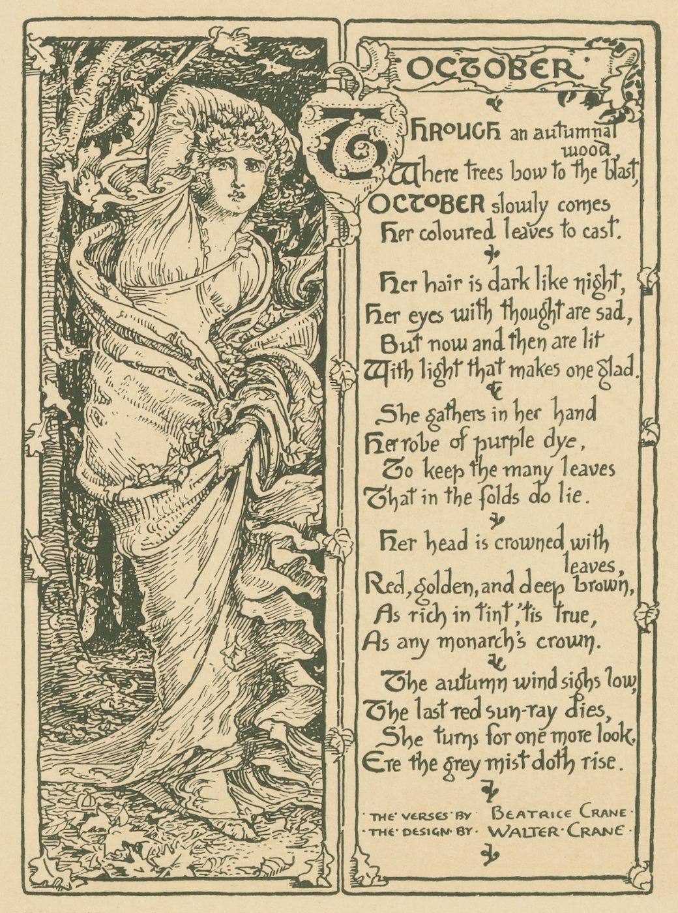

---

## General
- 26/10: had to turn off Nutshell’s “embed this” button, because it created extra line breaks and ruined site design
- 19/10: used Blowfish inbuilt timelines for the first time
- 17/10: started replacing Markdown quotes with Blowfish alerts in Sources metadata cards & descriptions
- 16/10: added support for [Nutshell: make expandable, embeddable explanations](https://ncase.me/nutshell/) by Nicky Case
- 05/10: tried to replace Notion tables with NocaDB ones – for now in cloud, will switch to self-host later if I like the result

## Moments
Published:
- [2025-10-24 Joined the R.O.S.E](https://cuprumbuddy.github.io/cuprum-garden/moments/2025-10-24-joined-the-r.o.s.e/)
## Projects
Published:
- [“We have university at home” but it's a list of materials that I actually used](https://cuprumbuddy.github.io/cuprum-garden/sources/we-have-university-at-home-but-its-a-list-of-materials-that-i-actually-used/)
- [🙋‍♀️ Questions to Ask Someday](https://cuprumbuddy.github.io/cuprum-garden/projects/questions-to-ask-someday/)
- [💬 quoteroll](https://cuprumbuddy.github.io/cuprum-garden/projects/quoteroll/)
- [📚 backlog](https://cuprumbuddy.github.io/cuprum-garden/projects/backlog/)
## Sources
Created pages for:
- [🖋 The Seductive Allure of Neuro Self-Help〈Tommy Blanchard〉](https://cuprumbuddy.github.io/cuprum-garden/sources/the-seductive-allure-of-neuro-self-help-tommy-blanchard/)
- [🗣 & 🔖 “Spiritual Successors” Info & FAQ〈ireallylikechikin on r/DiscoElysium〉](https://cuprumbuddy.github.io/cuprum-garden/sources/spiritual-successors-info--faq/)
- [🗣 I think people would armchair diagnose bad people with cluster B disorders much less...](https://cuprumbuddy.github.io/cuprum-garden/sources/i-think-people-would-armchair-diagnose-bad-people-with-cluster-b-disorders-much-less.../)
-  [📔 Soluzioni: A Practical Grammar of Contemporary Italian〈Denise De Rôme〉](https://cuprumbuddy.github.io/cuprum-garden/sources/soluzioni---a-practical-grammar-of-contemporary-italian/)
- [🖋 Self-consciousness wants to make everything about itself〈jessicata〉](https://cuprumbuddy.github.io/cuprum-garden/sources/self-consciousness-wants-to-make-everything-about-itself-jessicata/)
- [🔖 mooc.fi〈University of Helsinki〉](https://cuprumbuddy.github.io/cuprum-garden/sources/mooc.fi-university-of-helsinki/)
- [🎥 When a DEEP Character Pretends to be SHALLOW... (Hobie Brown)〈schnee〉](https://cuprumbuddy.github.io/cuprum-garden/sources/when-a-deep-character-pretends-to-be-shallow...-hobie-brown-schnee/)
