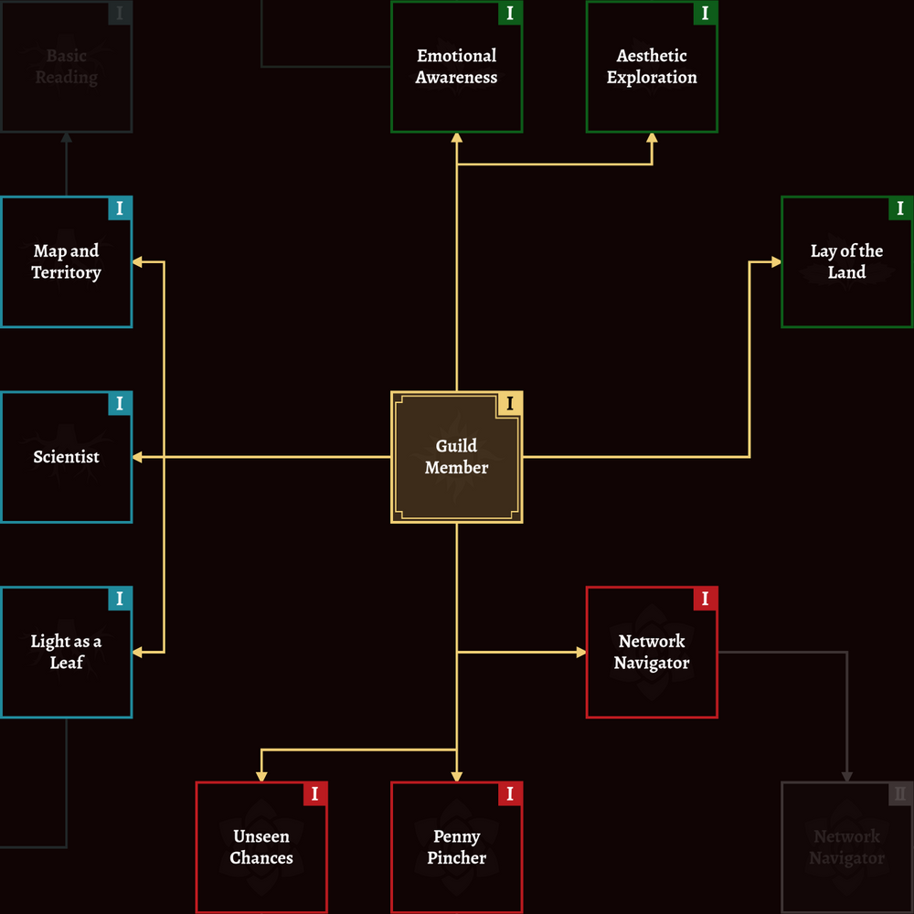

Just wanted to say that I finally joined [the Guild of the Rose](https://guildoftherose.org/)! 🥳

The Guild focuses on applied rationality – the art of achieving your goals. *The art of winning*, if you will. 

One of most outstanding features of the Guild is their roadmap consisting of bite-sized exercises aimed at developing life skills. 

> Each Skill belongs to one of the three Archetypes and we have Skills for everything from rationality to exercise to haggling. Generally speaking, each Archetype focuses on specific areas:
> 
> - Pragmatist: Direct life improvement, making money, and networking
> - Meditative: Mental and physical health, art, and community
> - Empiricist: Learning, teaching, and clear thinking
>
> […] Each Archetype can be worked on separately, allowing you to specialize and pursue what you find most rewarding. Real people are complex mixes of all three Archetypes, and the Path reflects that.

Somehow I haven't mentioned yet just how *GORGEOUS* this site is. Yes, I do love this map, and the image above is just a small piece of what awaits a guild member. 

(sadly, the map is kinda buggy on phone, so I recommend using laptop for the best experience)

To obtain a skill, the participant sometimes has to reflect on a task and submit their notes on site or share their findings at the Guild Discord server. I think it’s a rather interesting learning format: this way newcomers can go through the same exercises, yet provide new insights based on their own unique experiences. [Grayspaces](https://www.lesswrong.com/posts/kJCZFvn5gY5C8nEwJ/make-more-grayspaces) with rather soft built-in gradients are pretty cool. 

It seems, however, that the most active days of this community are gone. Consider joining as well, maybe? :) 
