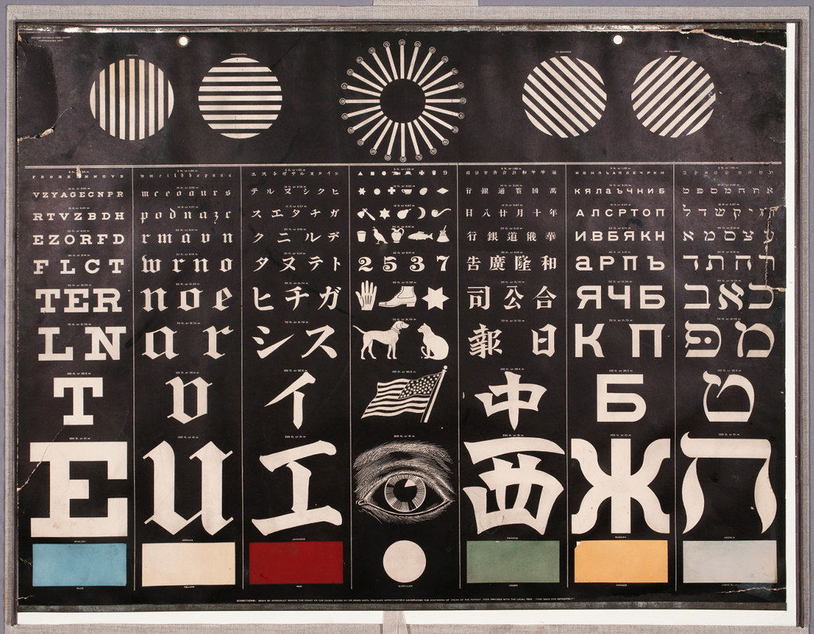

---





I must study Politicks and War that my sons may have liberty to study Mathematicks and Philosophy. My sons ought to study Mathematicks and Philosophy, Geography, natural History, Naval Architecture, navigation, Commerce and Agriculture, in order to give their Children a right to study Painting, Poetry, Musick, Architecture, Statuary, Tapestry and Porcelaine.
 

“John Adams to Abigail Adams, 12 May 1780,” <i>Founders Online</i>, National Archives, <a href="https://founders.archives.gov/documents/Adams/04-03-02-0258">https://founders.archives.gov/documents/Adams/04-03-02-0258</a> 





“A word is not the same with one writer as it is with another. One tears it from his guts. The other pulls it out of his overcoat pocket.” This is how Charles Peguy described writing individual words. The same thing is true of chapters and whole books. [...] It seems appropriate to acknowledge everyone who contributed to the long process, either by loaning me an overcoat or by helping me clean up my spilled guts.

Bradford Tuckfield, <i>DIVE INTO ALGORITHMS: A Pythonic Adventure for the Intrepid Beginner</i> (2021)





“He managed to betray a villain called ‘the Betrayer’, Squire,” Ratface grinned. “You have to hand it to him: he might have had only one trick but he was <i>great</i> at it.”
 
 
I rolled my eyes. “I’d be a little more impressed if he’d ruled longer than a decade. That kind of stupidity is why you don’t put the comic relief in charge.”
 
 
“You’ve got to respect that kind of an exit, though,” Robber mused. “I mean, poisoning himself and pinning it on over a hundred different people? Man knew how to leave the stage.”
 

ErraticErrata, <i>A Practical Guide to Evil</i> Book 2, Chapter 1: Supply (2015)





I imagine if I tried to date him, it'd be a lot of work to get him to understand me, like I'd have to force feed him myself. I'd rather have someone who's hungry. 

Aella, <i>The Difficulty in Dating Good Men</i> (2025). <a href="https://aella.substack.com/p/the-difficulty-in-dating-good-men">https://aella.substack.com/p/the-difficulty-in-dating-good-men</a>



[A]s Oliver Burkeman advises in <a href="https://curtismchale.ca/book/meditations-for-mortals-oliver-burkeman/">Meditations for Mortals</a> there is freedom in realizing that you won’t get everything done, that most of your tasks don’t matter and you should let them go because you’re never going to do them. They’re not valuable enough to bother with.
  
The problem isn’t that you haven’t found the right tool to control your tasks, it’s that you think it’s possible to control every task that flows your way.
  
The reason a new tool, or a new system for that matter, feels so good is that you give up on so many of the tasks that were weighing you down in the old system. You don’t move every idea over figuring that you’ll come back to them at some point, and then you never come back.

Curtis McHale, <i>Productivity as a Fetish</i> (2025). <a href="https://curtismchale.ca/2025/10/11/productivity-as-a-fetish/">https://curtismchale.ca/2025/10/11/productivity-as-a-fetish/</a>



 
<a href="https://paperconsumption.tumblr.com/post/718619616060047360">https://paperconsumption.tumblr.com/post/718619616060047360</a>
  




The trauma narrative feels like a rejection of the pain, because it's a belief that the pain is somehow not supposed to be there, like it's a foreign invader. I feel uncomfortable treating it like an invader (although I still do it sometimes because of social pressure).
   
There can be a lot of healing in surrendering the narrative and all the power and authority it gives you. I don't mean that you have to abandon it entirely, it's useful, after all - but evicting it from a place of identity inside yourself is necessary. If your wound is held open by a sense of wrongness, it will never have space to heal.

Aella, <i>The Trauma Narrative</i> (2018). <a href="https://aella.substack.com/p/the-trauma-narrative">https://aella.substack.com/p/the-trauma-narrative</a>




I feel like I’m in absolute <i>crazytown</i> that everyone seems to think the school system is okay. You’re pouring the most vivid years of someone’s life into the fucking drain, forcing them to sit and wait and stare at walls and spend their attention focusing on stuff that most of them don’t care about at all, and will barely remember afterwards. This is how you treat property, not people. 

Aella, <i>Chattel Childhood</i> (2025). <a href="https://aella.substack.com/p/chattel-childhood">https://aella.substack.com/p/chattel-childhood</a>



