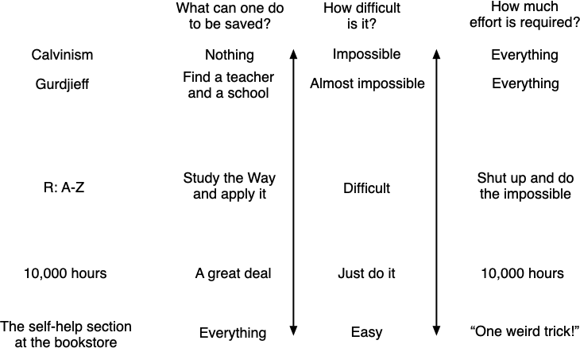

---



**Title:** Self-consciousness wants to make everything about itself
 
**Author:**
[jessicata (Jessica Taylor)](https://www.lesswrong.com/users/jessica-liu-taylor)
 
**URL:**
- https://www.lesswrong.com/posts/bwkZD6uskCQBJDCeC/self-consciousness-wants-to-make-everything-about-itself 
- https://unstableontology.com/2019/07/03/self-consciousness-wants-to-make-everything-about-itself/
 
**Date:**
2019-07-03


---


**Author's Abstract/Description/Introduction**

Here's a pattern that shows up again and again in discourse:

A: This thing that's happening is bad.

B: Are you saying I'm a bad person for participating in this? How mean of you! I'm not a bad person, I've done X, Y, and Z!

It isn't always this explicit; I'll discuss more concrete instances in order to clarify. The important thing to realize is that A is pointing at a concrete problem (and likely one that is concretely affecting them), and B is changing the subject to be about B's own self-consciousness. Self-consciousness wants to make everything about itself; when some topic is being discussed that has implications related to people's self-images, the conversation frequently gets redirected to be *about* these self-images, rather than the concrete issue. Thus, problems don't get discussed or solved; everything is redirected to being about maintaining people's self-images.


---

Funnily enough, while I was choosing colors for the cards above I’ve reread the excerpt above a few times and realized that self-consciousness is one of the reasons why I felt so lonely. “Self-consciousness wants to make everything about itself”, and I definitely felt it. Standing alongside someone and waiting when the conversation will switch to something I can talk about, scrolling personal blogs of my acquaintances hoping that I’ll see the traces of me in their posts… It’s difficult to pinpoint right away, but there’s definitely something connecting being ashamed of oneself, rejection sensitivity, lack of agency in relationship, the need to belong and the perceived lack of acceptance from the others.

Like, thinking about oneself too much makes one lonelier, feeling lonely makes one more self-conscious, resulting in even more loneliness… 

Also the issue “*I don’t know how to express that I emphasize without sharing my own experiences* vs *It’s annoying when people change the subject to themselves*” seems to be pretty relevant.

I mean, relevant to general [:self-consciousness](https://en.wikipedia.org/wiki/Self-consciousness) topic, namely “a preoccupation with oneself, especially with how others might perceive one's appearance or one's actions”. However, I’m prone to reflect on my own relationships, while Jessica's post is about politics and epistemologically faulty ways to protect one’s place in social hierarchy. I’m thinking about self-consciousness of a person who doesn't belong, while Jessica writes about self-consciousness as a reason to attack someone who’s threatening one’s place within a community. 

---

Returning to the original post, I definitely want to share + save for later some quotes about common ego-protective tactics:

> A [:tone argument](https://en.wikipedia.org/wiki/Tone_policing) criticizes an argument not for being incorrect, but for having the wrong tone. Common phrases used in tone arguments are: "More people would listen to you if...", "you should try being more polite", etc. […] Tone arguments are about people protecting their self-images when they or a group they are part of (or a person/group they sympathize with) is criticized. When a tone argument is made, the conversation is no longer about the original topic, it's about how talking about the topic in certain ways makes people feel ashamed/guilty. Tone arguments are a key way self-consciousness makes everything about itself.
