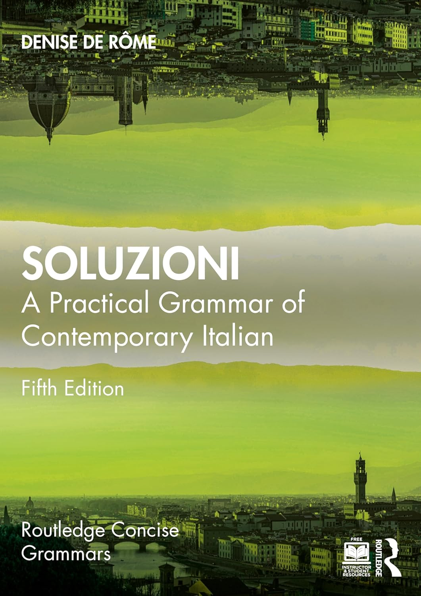

---

> Title: Soluzioni: A Practical Grammar of Contemporary Italian
> 
> Author: Denise De Rôme
> 
> Date: 2025 (5th ed.)
> 
> License: All rights reserved. No part of this book may be reprinted or reproduced or utilised in any form or by any electronic, mechanical, or other means, now known or hereafter invented, including photocopying and recording, or in any information storage or retrieval system, without permission in writing from the publishers.

---

> The newest edition of _Soluzioni: A Practical Grammar of Contemporary Italian_ combines an engaging reference and grammar practice explained in clear and concise language with numerous supporting exercises. Aimed at keen students of all levels, _Soluzioni_ also has a companion website at www.routledge.com/cw/derome which provides further resources for students and instructors. There are 240 free interactive language quizzes, plus supplementary downloadable material such as a comprehensive verb section and full answer key. This fifth edition continues the accessible methodology and focus on contemporary usage that has made _Soluzioni_ the clearest pedagogic grammar book on the market today. Fully updated, it covers key areas of difficulty such as tense usage (including the subjunctive), causative verbs, combined pronouns and word order. It also pays attention to the links between grammar and communicative functions as well as those between grammar, context and register. Suitable for class use and independent study, _Soluzioni_ is the ideal reference and practice resource for learners of Italian.

---

An **EXTREMELY** thorough textbook. It won’t be suitable for learning Italian as a beginner, since the amount of information is rather overwhelming, but otherwise it’s an excellent resource for more proficient students who’d like to get a better understanding of grammar & Italian teachers. 

For a while the 4th edition of *Soluzioni* was my go-to textbook for What I Know About Italian project. However, the book is so concise yet comprehensive that I started to fear that I would run into copyright issues sooner of later if I ever publish these posts so I largely had to switch to textbooks with permissive licenses. 
